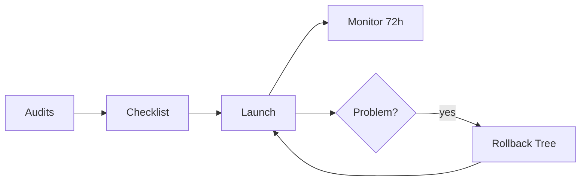

# Preflight Checks

[](LICENSE)

**Ship with confidence.** Systematic production readiness checks for any software project — web apps, mobile apps, APIs, games, CLIs.

> You built the thing. But is it ready to ship? These playbooks walk you through 7 audits, a go/no-go checklist, 72 hours of post-launch monitoring, and a rollback decision tree. Stack-agnostic, tool-agnostic, and designed to work with AI coding assistants or on their own.

---

## What's Included

| Document | Purpose | When to Use |
|----------|---------|-------------|
| [Production Readiness Playbook](production-readiness-playbook.md) | 7 systematic audits covering quality, security, compliance, accessibility, performance, SEO, and ops | Weeks before launch |
| [Pre-Launch Checklist](pre-launch-checklist.md) | Binary go/no-go gate with MUST / SHOULD / NICE tiers | Day before launch |
| [Post-Launch Runbook](post-launch-runbook.md) | Hour-by-hour monitoring guide with platform-specific sections | First 72 hours after launch |
| [Rollback Decision Tree](rollback-decision-tree.md) | Severity triage — rollback, hotfix, or accept and monitor | When something breaks |
| [Start Here](start-here.md) | One prompt that runs the full process end-to-end | Getting started |

---

## The Flow



---

## The 7 Audits

The [Production Readiness Playbook](production-readiness-playbook.md) covers:

1. **Quality** — Tests, CI, code health, pre-commit hooks
2. **Security** — Secrets, dependencies, auth, headers, input validation
3. **Compliance & Legal** — Privacy policies, cookie consent, GDPR/CCPA, EULA, platform rules
4. **Accessibility** — WCAG AA, keyboard navigation, screen readers, color contrast
5. **Performance** — Core Web Vitals, Lighthouse, bundle size, caching
6. **SEO & Discoverability** — Meta tags, structured data, sitemaps, social cards
7. **Operational Readiness** — Deployment, rollback, monitoring, alerting, backups

Each audit is a self-contained prompt you can copy into any AI coding assistant. Skip audits that don't apply to your project type — the playbook tells you which ones.

---

## Quick Start

**1. Clone this repo**

```bash
git clone https://github.com/penguinboi/preflight-checks.git
```

**2. Open your project in an AI coding assistant**

Works with Claude Code, Cursor, Copilot, Windsurf, or any tool that can read files and analyze code.

**3. Paste this prompt**

```
Read /path/to/preflight-checks/start-here.md and follow its instructions for this project.
```

The assistant will assess your project, recommend which audits to run, execute them in order, and walk you through the pre-launch checklist.

You can also run individual audits standalone — copy any audit prompt from the playbook into a conversation with your project open.

---

## Works With

- **AI coding assistants:** Claude Code, Cursor, GitHub Copilot, Windsurf, or any assistant that can read local files
- **Manually:** The audit prompts are structured checklists — run them yourself without AI
- **Any stack:** Static sites, SPAs, mobile apps, APIs, games, CLIs, libraries
- **Any platform:** AWS, Vercel, App Store, Google Play, Steam, itch.io, npm, self-hosted

---

## When to Re-run

| Trigger | What to run |
|---------|-------------|
| Quarterly | Quality + Security audits |
| After major changes | The relevant audit (UI changes → Accessibility, new data collection → Compliance, etc.) |
| New launch | Full cycle — all 7 audits, checklist, monitoring |

---

## License

MIT — see [LICENSE](LICENSE). Built by [Penguinboi Software](https://penguinboisoftware.com).
